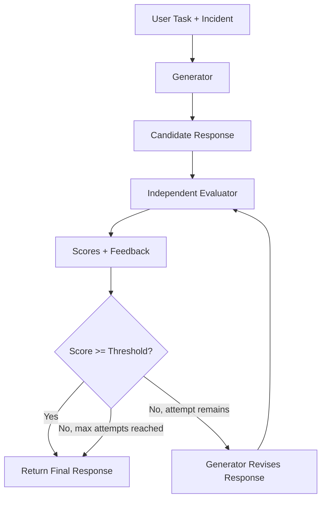

# Generator–Evaluator Harness Exercise

## Learning objective

The generator writes a candidate incident analysis. A separate LLM invocation,
with a different system prompt and a fresh context, reviews that candidate. The
harness passes review feedback into another generator attempt when needed and
decides when to stop. **The LLM is not the harness.**

After this exercise, you should be able to explain the generator's work, the
evaluator's judgment, why their contexts are separate, how feedback moves back
to the generator, and why the harness owns the score threshold and maximum
attempts. You should also be able to explain why these five quality judgments
are *inferential*: they require reasoning about evidence and alternatives,
rather than an exact programmatic answer.

## Architecture



The harness chooses which component runs, what context it receives, how
feedback moves, and when execution stops. A single SDK client may make both
requests, and `OPENAI_EVALUATOR_MODEL` may equal `OPENAI_MODEL`; independence
comes from the separate invocation, prompt, and context. The evaluator sees
only the original incident, original task, and current candidate. It does not
see the generator system prompt, prior reviews, or any hidden reasoning.

The evaluator scores evidence grounding, causal reasoning, completeness,
uncertainty, and actionability from 1 to 5, with rationales. It identifies a
weakness and gives actionable revision feedback without rewriting the answer.
The harness uses the arithmetic average of those five model judgments and
stops at 4.2/5 or after three attempts. Computing an average is bookkeeping;
it does not add a deterministic quality check. Scores may improve, remain
flat, or decline on a particular run.

## Set up and run

Use Python 3.10 or newer. From this directory:

```bash
python3 -m venv .venv
source .venv/bin/activate
python -m pip install -r requirements.txt
cp .env.example .env
```

Edit `.env` to set `OPENAI_API_KEY` and `OPENAI_MODEL` to a model available to
your account that supports structured outputs. Optionally set
`OPENAI_EVALUATOR_MODEL`; when it is blank, the evaluator uses `OPENAI_MODEL`.
Keep `.env` private. API calls consume tokens.

```bash
python -m starter.main
python -m solution.main
python -m solution.self_evaluation_demo
```

Run these commands from `generator_evaluator_exercise/` so the imports resolve.
The starter prints a helpful TODO message until you fill in its loop. The
solution prints each candidate, all five evaluator scores and rationales,
feedback, the threshold decision, final score change, and API token totals
when usage is reported. [The sample transcript](expected_output/example_run.txt)
is illustrative and abridged; real answers and scores vary.

## Exercise files

- `shared/` provides the fictional incident, task, model settings, SDK client,
  and Pydantic review shape.
- `starter/` contains four marked tasks and ready-made console formatting.
- `solution/` shows a complete ordinary-Python reference implementation and
  an optional comparison demo.

Self-evaluation is not guaranteed to fail on every example. The structural
problem is that the same model and context that produced the response are
being asked to independently challenge it. Separation creates a distinct
evaluation context and makes the review process observable and controllable
by the harness.

This first exercise stays with generation, independent judgment, feedback,
and regeneration. All five quality criteria are reviewed by the evaluator
model; later course material can introduce other kinds of enforcement.
